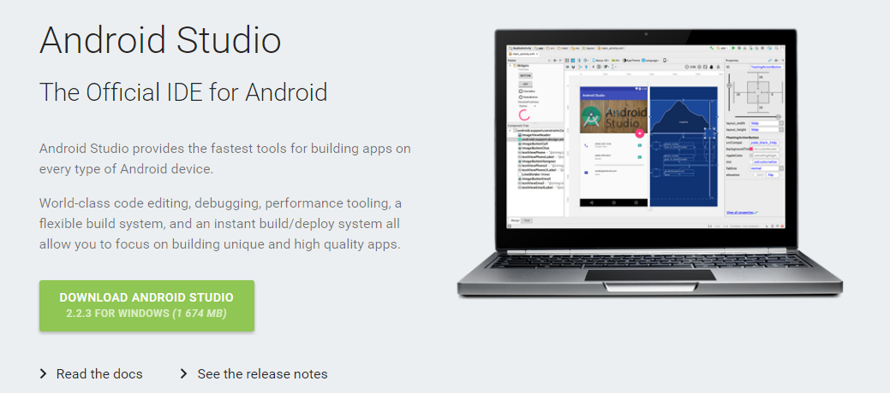
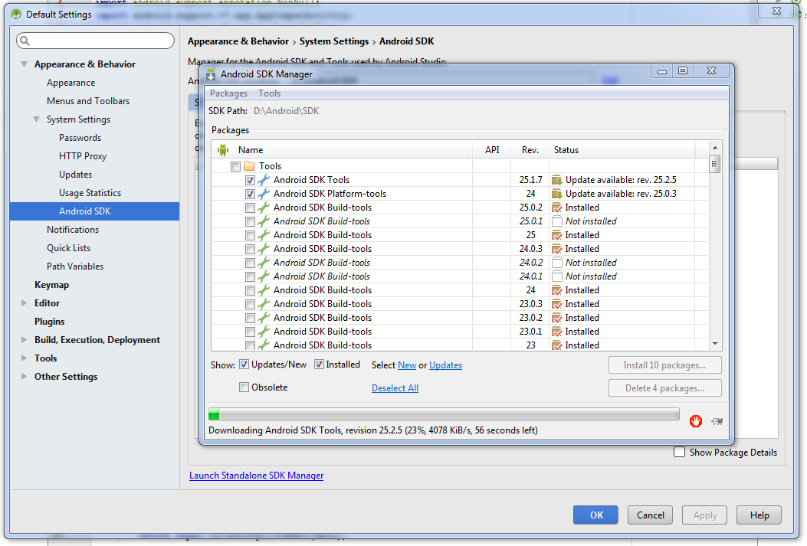
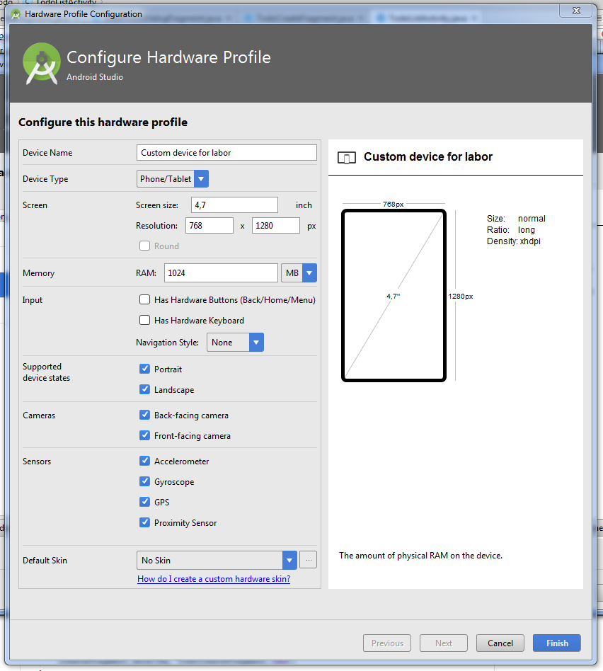
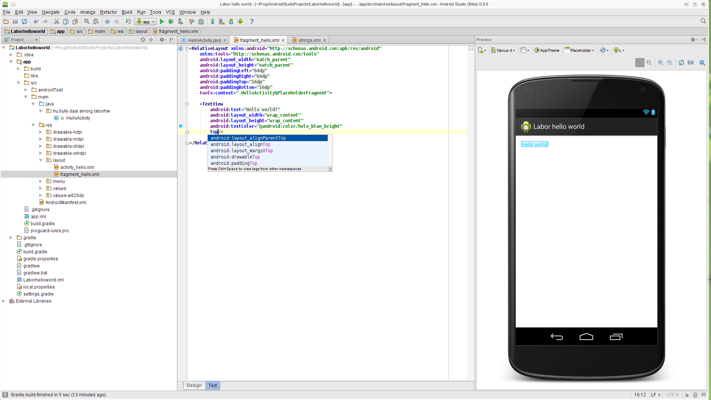
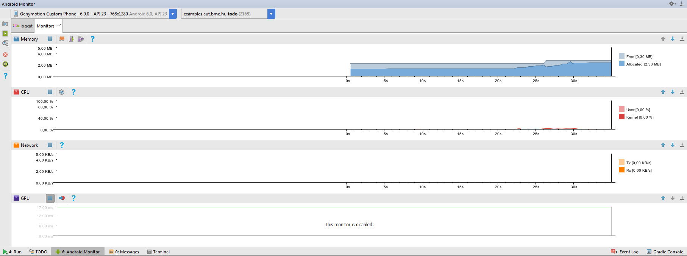
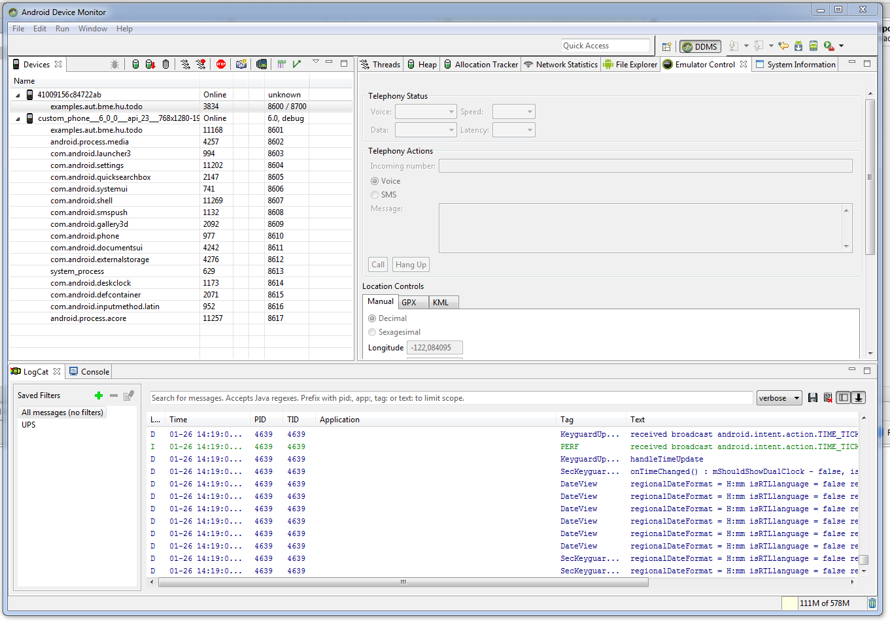

# Labor 0 - Hello World

A mérés célja, hogy bemutassa az Android fejlesztőkörnyezetet, az alkalmazáskészítés, illetve a tesztelés és fordítás folyamatát, az alkalmazás felügyeletét, valamint az emulátor és a fejlesztőkörnyezet funkcióit. Továbbá, hogy ismertesse egy Hello World alkalmazás elkészítésének módját.
A mérés során a laborvezető részletesen bemutatja az eszközöket.

A mérés az alábbi témákat érinti:

*   Az Android platform alapfogalmainak ismerete
*   Android Studio fejlesztőkörnyezet alapok
*   Android Emulátor tulajdonságai
*   DDMS (Android Device Monitor) nézet jellemzői
*   Android projekt létrehozása és futtatása emulátoron
*   Manifest állomány felépítése

###  Fordítás menete Android platformon

A projekt létrehozása után a forráskód az _src_ könyvtárban, míg a felhasználói felület leírására szolgáló XML állományok a _res_ könyvtárban találhatók. Az erőforrás állományokat egy “_R.java”_ állomány köti össze a forráskóddal, így könnyedén elérhetjük Java oldalról az XML-ben definiált felületi elemeket. Az Android projekt fordításának eredménye egy APK állomány, melyet közvetlenül telepíthetünk mobil eszközre.

1.  A fejlesztő elkészíti a Java forráskódot, valamint az XML alapú felhasználói felületleírást a szükséges erőforrás állományokkal.

2.  A fejlesztőkörnyezet az erőforrás állományokból folyamatosan naprakészen tartja az „_R.java_” erőforrás fájlt a fejlesztéshez és a fordításhoz. **FONTOS: az “_R.java_” állomány generált, kézzel SOHA ne módosítsuk!**

3.  A fejlesztő a Manifest állományban beállítja az alkalmazás hozzáférési jogosultságait (pl. Internet elérés, szenzorok használata, stb.).

4.  A fordító a forráskódból, az erőforrásokból és a külső könyvtárakból előállítja a Dalvik/[ART](https://hu.wikipedia.org/wiki/Android_Runtime) virtuális gép gépi kódját.

5.  A gépi kódból és az erőforrásokból előáll a nem aláírt APK állomány.

6.  Végül a rendszer végrehajtja az aláírást és előáll a készülékekre telepíthető aláírt APK.

Az Android Studio Gradle-t használ, ami lehetőséget biztosít köztes állapot produkálására, erről részletesebben a Gradle részben lesz szó (későbbi labor anyaga).

**Megjegyzések:**

*   A teljes folyamat a fejlesztői gépen megy végbe, a készülékekre már csak bináris állomány jut el.

*   A külső könyvtárak általában JAR állományként, vagy egy másik projekt hozzáadásával illeszthetők az aktuális projekthez.

*   Az APK állomány leginkább a Java világban ismert JAR állományokhoz hasonlítható.

*   A Manifest állományban meg kell adni a támogatni kívánt Android verziót, mely felfele kompatibilis az újabb verziókkal, régebbi verzióra azonban már nem telepíthető.

*   Az Android folyamatosan frissülő verziói nagy gondot jelentenek a fejlesztőknek.

*   Az Android alkalmazásokat tipikusan az Android Playben szokták publikálni, így az APK formátumban való terjesztés nem annyira elterjedt.

*   A teljes folyamat a szoftverfejlesztők számítógépein megy végbe, az ügyfélhez a bájtkódokat tartalmazó kész alkalmazás jut el.

Fordítás menete Android platformon

### SDK és könyvtárai

A [d.android.com/sdk](https://developer.android.com/studio) oldalról letölthető az IDE és az SDK. Ennek fontosabb mappáit, eszközeit tekintsék át a laborvezető segítségével!

SDK szerkezet

*   **docs:** Dokumentáció
*   **extras:** különböző extra szoftverek helye. Maven repository, support libes anyagok, analytics sdk, google [android usb driver](https://developer.android.com/studio/run/win-usb.html) (amennyiben SDK managerrel ezt is letöltöttük) stb.
*   **platform-tools:** fastboot és adb binárisok helye (legtöbbet használt eszközök)
*   **platforms, samples, sources, system-images:** minden API levelhez külön almappában a platform anyagok, források, példaprojektek, OS imag-ek
*   **tools:** fordítást és tesztelést segítő eszközök, SDK manager, DDMS, 9Patch drawer, emulátor binárisok stb.

### AVD és SDK manager

Az SDK kezelésére az SDK managert használjuk, ezzel lehet letölteni és frissen tartani, az eszközeinket. Indítása a *tools/android binárissal*, paraméter nélkül történhet, vagy fejlesztői környezeten keresztül.

SDK manager ikon:

SDK manager felülete:

Indítsuk el, és vizsgáljuk meg a laborvezetővel, rendelkezésre áll-e minden, ami az első alkalmazásunkhoz kelleni fog.

### AVD

Az AVD az Android Virtual Device rövidítése. Ahogy arról már előadáson is szó esett, nem csak valódi eszközön futtathatjuk a kódunkat, hanem emulátoron is. (Mi is a különbség szimulátor és emulátor között?) Az AVD indítása a *tools/android bináris ‘avd’* paraméterrel, vagy fejlesztői környezeten keresztül lehetséges.

AVD ikon:

Az AVD bal oldali tabfülén a létező virtuális eszközök listáját találjuk, jobb oldalon pedig az ún. eszköz definíciókét. Itt néhány előre elkészített sablon áll rendelkezésre, magunk is készíthetünk ilyet, ha tipikusan adott eszközre szeretnénk fejleszteni (pl. galaxy s4). Készítsünk új emulátort (értelemszerűen csak olyan API szintű eszközt készíthetünk, amilyenek rendelkezésre állnak az SDK manageren keresztül)!

1.  A bal oldali tabfülön, kattintsunk a jobb oldali “Create…” gombra!
2.  Töltsük ki a mezőket!
    1.  Név legyen mondjuk “Labor_2″
    2.  Az eszköz pl. Nexus 5
    3.  Célnak adjunk meg egy rendelkezésre álló API szintet
    4.  CPU/ABI alapvetően ARM alapú legyen. (Az SDK támogatja a hardveres gyorsítást, ha ez be van állítva, akkor x86-os architektúrát is választhatunk)
    5.  Van-e billentyűzet, milyen kinézete legyen.
    6.  Kamera(ák): WebcamX, hardveres kamera, ami a számítógépre van csatlakoztatva; Emulated, egy szoftveres megoldás, most legalább az egyik kamera legyen ilyen.
    7.  Memória mérete. A laborszámítógépeken, mivel kevés a rendszermemóriánk nem érdemes 768 MB-nál többet adni, könnyen futhat az ember problémákba. Ha az emulátor lefagy, vagy az egész OS megáll működés közben, akkor állítsuk alacsonyabbra az értéket (saját laptop esetén 8GB vagy több rendszermemória esetén nyugodtan állíthatjuk az emulátor memóriáját 1024/2048MB-ra). VM heap, az alkalmazások virtuális gépének szól, maradhat az alapérték. Tudni kell, hogy készülékek esetében gyártónként változik.
    8.  Belső flash memória és SD kártya mérete.
    9.  Snapshot: elmenti az emulátor állapotát, és abból tölti vissza legközelebb, ha igényeljük.
    10.  GPU segítsége: Kizáró vagy kapcsolatban áll a Snapshot funkcióval, viszont nem csak a megjelenésen tud javítani, az emulátor sebessége is javulhat tőle. Gyengébb GPU és IO teljesítmény esetén inkább a snapshotot válasszuk. (Intel HD4000 és alatta, például)
3.  Ha mindent rendben talál az ablak, akkor OK!

Új emulátor készítése

Indítsuk el az új emulátort! A felbukkanó Launch options ablakban lehetőségünk van leskálázni a felbontást (például arra az esetre, ha esetleg nem 1:1 arányban szeretnénk megfeleltetni  1920×1080 pixelt az 1366×768-as kijelzőnkön), törölhetjük az adatokat (wipe user data ~ gyári visszaállítás) illetve befolyásolhatjuk a snapshot állapotát.

Az elindított emulátoron próbálják ki az “API Demos” és “Dev Tools” alkalmazásokat!

Megjegyzés: A gyári emulátoron kívül több alternatíva is létezik, a Genymotion az egyik legjobb, nagyon gyors AMD processzorokon is (igaz Windows 10 esetén problémás a használata).

## Fejlesztői környezet

Android fejlesztésre a labor során a JetBrains IntelliJ alapjain nyugvó Android Studio-t fogjuk használni. A Studio-val ismerkedők számára kivételesen hasznos funkció a “Tip of the day”, érdemes egyből kipróbálni, megnézni az adott funkciót. Induláskor a legutóbbi projekt nyílik meg, ha nincs ilyen, vagy minden projektünket bezártuk, a menüpontok értelemszerűek.

## Hello World

A laborvezető segítségével készítsenek egy egyszerű Hello World alkalmazást!

###  Android Studio

Ez a rész azoknak szól, akik korábban már használták az Eclipse nevű IDE-t, és szeretnék megismerni a különbségeket az Android Studio-hoz képest.

*   **Import régi projektekből:** Android Studioban lehetséges a projekt importálása régebbi verziójú projektekből és a régi Eclipse projektekből is.
*   **Projektstruktúra:**  A Studio Gradle-lel fordít, és más felépítést használ. Projekten belül:
    *   .idea: IDE fájlok
    *   app: forrás
        *   build: fordított állományok
        *   libs: libraryk
        *   src: forráskód, azon belül is külön projekt a tesztnek, és azon belül pedig “_res_” könyvtár, illetve “_java_“. Java-n belül már a csomagok vannak.
    *   gradle: gradle fájlok
*   **Hasznos funkciók:**
    *   IntelliSense, fejlett refaktoráció támogatás
    *   Ha egy sorban színre, vagy képi erőforrásra hivatkozunk, a sor elejére kitesz egy miniatűr változatot.
    *   Ha közvetve hivatkozott erőforrást (akár getResources.get…, akár R…..) adunk meg, összecsukja a hivatkozást és a tényleges értéket mutatja. Ha rávisszük az egeret felfedi, ha kattintunk kibontja a hivatkozást.
    *   Névtelen belső osztályokkal is hasonlót tud, javítva a kód olvashatóságát.
    *   Kódkiegészítésnél szabad a kereső, a szótöredéket keresi, nem pedig a szóval kezdődő lehetőségeket (lásd képen)
    *   Változónév ajánlás: amikor változónévre van szükségünk, nyomjunk CTRL+SPACE-t. Ha adottak a körülmények, a Studio egész jó neveket tud felajánlani.
    *   Szigorú lint. A Studio megengedi a warningot. Ezért szigorúbb a lint, több mindenre figyelmeztet (olyan apróságra is, hogy egy view egyik oldalán van padding, a másikon nincs)
    *   Layout szerkesztés. A grafikus layout építés lehetséges, 2016-os béta verziós újítás: *CoordinatorLayout*.
    *   CTRL-t lenyomva navigálhatunk a kódban (pl. osztályra, metódushívásra kattintva). Ezt a navigációt (és az egyszerű másik osztályba kattintást is) rögzíti, és a history előre-hátra gombokkal lehet lépkedni benne. Ha van az egerünkön/billentyűzetünkön ilyen gomb, és netes böngészés közben aktívan használjuk, ezt a funkciót nagyon hasznosnak fogjuk találni.
    *   Szín ikonja a sor elején; kiemelve jobb oldalon, hogy melyik nézeten vagyunk; szabadszavas kiegészítés; a “Hello world” igazából _“@string/very_very_very_long_hello_world”_

### Billentyűkombinációk

*   **CTRL + ALT + L:** Kódformázás
*   **CTRL + SPACE:** Kódkiegészítés
*   **SHIFT + F6:** Átnevezés (Mindenhol)
*   **F2:** A következő error-ra ugrik. Ha nincs error, akkor warningra.
*   **CTRL + Z** illetve **CTRL + SHIFT + Z:** Visszavonás és Mégis
*   **CTRL + P:** Paraméterek mutatása
*   **ALT + INSERT:** Metódus generálása
*   **CTRL + O:** Metódus felüldefiniálása
*   **CTRL +F9:** Fordítás
*   **SHIFT + F10:** Fordítás és futtatás
*   **SHIFT SHIFT:** Keresés mindenhol

### Eszközök, szerkesztők

A View menü Tool Windows menüpontjában lehetőség van különböző ablakok ki- és bekapcsolására. Laborvezető segítségével tekintsék át az alábbi eszközöket!

*   Project
*   Structure
*   Debug
*   TODO
*   Terminal
*   Messages
*   Gradle

Lehetőség van felosztani a szerkesztőablakot, ehhez kattinsunk egy megnyitott fájl tabfülére jobb gombbal!

### Hasznos beállítások

A laborvezető segítségével állítsák be a következő hasznos funkciókat:

*   kis- nagybetű érzékenység kikapcsolása a kódkiegészítőben (settingsben keresés: sensitive)
*   "laptop mód" ki- és bekapcsolása (File/Power Saver mode)
*   sorszámozás bekapcsolása (settingsben keresés: Show line numbers)
*   beírás közbeni autoimport bekapcsolása (settingsben keresés: import, utána Editor/Auto import)

### Generálható elemek

A Studio sok sablont tartalmaz, röviden tekintsék át a lehetőségeket:

*   Projektfában, projektre jobb gombbal kattintva -> new -> module
*   Projektfában, modulon belül, Java-ra kattintva jobb gombbal -> new
*   Forráskódban ALT+INSERT billentyűkombinációra

## Android Device Monitor

A készülék erőforráashasználata [monitorozható](https://developer.android.com/studio/profile/android-monitor.html?utm_source=android-studio) ezen a felületen egyéb hasznos funkciók, mint a képernyőfelvétrel készítés (kamera ikon) mellett.

## Fejlett Android Device monitor / DDMS

Android studio -> Tools -> Android -> Android Device Monitor
Itt lehetséges virtuális SMS vagy telefonhívás küldése, fake GPS pozíció beállítása, a fájlok monitoirozása egyébb fejlesztéshez hasznos eszközök mellett.

## Feladatok:

1.  Az új alkalmazást futtassák emulátoron (akinek saját készüléke van, az is próbálja ki)!
2.  Helyezzenek breakpointot a kódba, és debug módban indítsák az alkalmazást! (érdemes megyfigyelni, hogy most másik Gradle Task fut a képernyő alján)
3.  Indítsanak hívást és küldjenek SMS-t az emulátoron! Mit tapasztalnak?
4.  Tekintse át a DDMS nézet funkcióit a laborvezető segítségével!
5.  Hajtson végre egy telefonhívást a DDMS nézetről!
6.  Küldjön egy SMS-t a DDMS nézetről!
7.  Változtassa a készülék pozícióját a DDMS nézeten!
8.  Vizsgálja meg az elindított HelloWorld projekt nyitott szálait, memóriafoglalását!
9.  Vizsgálja meg a LogCat nézet tartalmát!
10.  Keresse ki a létrehozott HelloWorld projekt mappáját és a bin könyvtáron belül
    vizsgálja meg az .apk állomány tartalmát! Hol található a lefordított kód?
