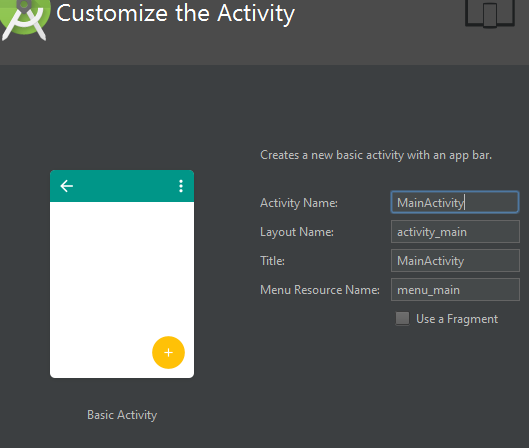
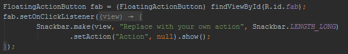
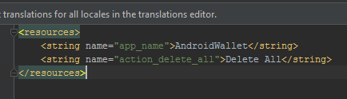
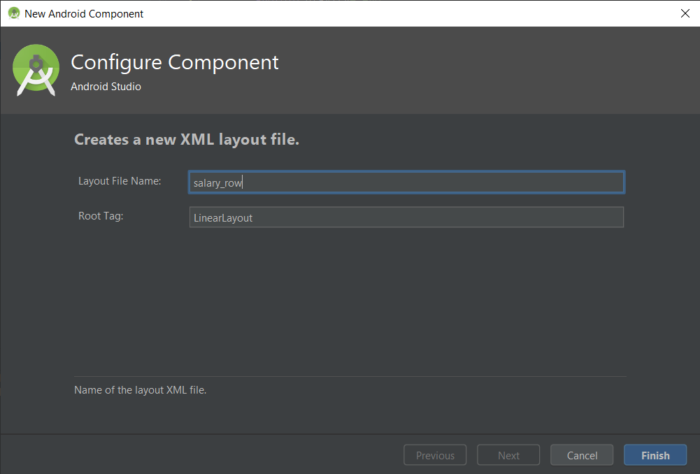
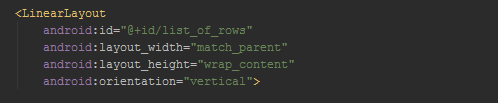

# Labor 03 - Felhasználói felület tervezés és készítés Android platformon

## Felkészülés a laborra

A labor célja egy egyszerű felhasználói felület tervezése, kivitelezése. A labor elején a
laborvezető röviden bemutatja az alkalmazás részeit majd ezután önállóan a jelen
dokumentáció segítségével kell elkészíteni az alkalmazást.

### Felhasznált technológiák:
- Activity
- LinearLayout, TextView, ImageView, EditText, Button, ToggleButton
- LayoutInflater

## Feltöltés
Az elkészült megoldást egy ZIP formájában (teljes Android Studio projekt – build
mappa kivehető) kell feltölteni a tárgy oldalán, ahol a laborvezető tudja értékelni.

## Értékelés
- Beviteli rész: 1 pont
- Listaelemek layoutja: 1 pont
- Listaelemek inflate-elése: 1 pont
- Toast üzenetek helyett SnackBar (önálló): 1 pont
- Összegző mező megjelenítése (önálló): 0,5 pont
- Összegző mező helyes működése (önálló): 0,5 pont

## Az elkészítendő megoldás
A feladat egy kiadás / bevétel naplózására alkalmas alkalmazás elkészítése
AndroidWallet néven. Az alkalmazás alap funkcionalitása, hogy a felhasználó fel
tudja venni egy listába a kiadásait, bevételeit vagy törölni tudja az egész lista tartalmát.

A képernyő mintaképe:


Az alkalmazás felépítése és működése a következő:

- Kezdőképernyő a listával illetve egy beviteli résszel, amelyen a felhasználó
beír egy megnevezést és egy összeget, megadja a pénzforgalom irányát, és el
tudja menteni a listába a tranzakcióját. Amennyiben itt bármelyik mező
üres, a mentést meg kell akadályoznunk.
- Egy listaelem felépítése:
  - Ikon a pénzforgalom irányától függően.
  - A megadott megnevezés és alatta az összeg.
- A Toolbaron egy menüpont a lista teljes törlésére.
- A lista görgethető kell legyen (a későbbi laborokban a profi lista kezelésre
majd a RecyclerView komponenst fogjuk használni).

## Laborfeladatok

A labor során az alábbi feladatokat kell megvalósítani a laborvezető
segítségével, illetve a jelölt feladatoknál önállóan.

### Kezdő projekt létrehozása

Hozzon létre egy AndroidWallet nevű projektet Android Studioban:
- File->New->New Project
- Application name: AndroidWallet
- Company Domain: aut.bme.hu
- Láthatjuk, hogy ez alapján automatikusan a hu.bme.aut.androidwallet package-et kapja az alkalmazás.
- Phone and Tablet, Minimum SDK maradhat API 15;
- válasszuk a Basic Activity-t;
- az Activity nevéhez próbáljunk meg egy betűt vagy szót írni, figyeljük meg,
hogy az összes többi mezőt is ehhez igazítja a varázsló, ez egy hasznos funkciója
a varázslónak, de maradjunk most a MainActivity elnevezésnél;
- Finish, és várjuk meg amíg a Studio mindent legenerál, ez első alkalomkor
valamivel hosszabb időt vesz igénybe.



### Számunkra szükségtelen részek eltávolítása

Mivel a varázsló olyan dolgokat is generál, amelyelre nekünk semmi szükségünk most, ezért
ezeket most eltávolítjuk. 
- A Studio a generálást követően a content_main.xml fájlt hozza be, ebből töröljük a TextView komponenst.
- Nyissuk meg a res/layout/activity_main.xml fájlt, és töröljük ki belőle a FloatingActionButtont
(mellesleg itt láthatjuk is az includeolt content_main layoutot).
- Nyissuk meg a MainActivity osztályt, ebből a FloatingActionButton-hoz kapcsolódó részt töröljük.



Az előkészületeink után egy első futtatást ki is próbálhatunk, akinél van kábel akár saját
készüléken, vagy az előre telepített emulátoron (érdemes a laborgépek korlátozott erőforrásai miatt
saját készüléket használni).

Mint látjuk, az történt, amit vártunk, a kezdeti Hello world felirat eltűnt, a Floating Action Button
(jobb alul „lebegő” funkció gomb, lásd Gmail, Messenger alkalmazások) eltűnt, van egy ablakunk az
alkalmazás nevével és egy lenyíló menünk amit a szemfülesek már a kódból észre vehettek, hogy nem fog
csinálni semmit a kattintásra. De mivel ez a menüpont a Settings nevet viseli, ezt azonnal korrigáljuk is.


- res/values/strings: egy új stringet veszünk fel a már ott megtalálhatókhoz hasonlóan
action_delete_all néven és Delete All tartalommal, illetve az action_settingset töröljük.



- Majd a res/menu/menu_main.xml-ben a pirosra változott action_settingset javítjuk az általunk
hozzáadott új action_delete_allra.

### Beviteli rész megvalósítása

Az alkalmazás működéséhez szükség lesz két EditTextre, amelyekben a felhasználó a megnevezést
és az összeget adhatja meg. Szükséges továbbá egy kapcsoló működésű gomb, például a ToggleButton,
amellyel a pénzforgalom irányát állíthatja, illetve mentés gombra, amelyet egy egyszerű
Button fog megvalósítani.

Egy XML fájlt megnyitva két lehetőségünk van: vagy a beépített grafikus szerkesztőn drag and
drop módszerrel összerakjuk a felületet, vagy kézzel XML-ben írjuk meg a komponenseket és a
tulajdonságaikat. Előbbi a tanulási fázisban nagyon hasznos, mert könnyen tudunk puskázni,
viszont később sok fejfájást okozhat, ezért az XML leírás plusz előnézettel fogjuk
megvalósítani a feladatot.

Mivel a feladatunk lineárisan összerakható elemekből épül fel, ezért érdemes egy ilyen
magvalósításban gondolkodnunk.
- Nyissuk meg a res/layout/content_main.xml fájlt. (Akinek nem jelenik meg egyből a preview nézet, jobb oldalon találja a gombot).
- Módosítsuk az előre legenerált ConstraintLayoutot LinearLayoutra,
(Az Android Studio már kezeli, hogy ha a kezdő XML taget módosítjuk, akkor a zárót is átírja automatikusan) és adjuk hozzá
az android:orientation="vertical" attribútomot.
- Szükségünk lesz másik három LinearLayout-ra:
  - A név és összeg mezőnek, horizontális elrendezéssel
  - A kiadás/bevétel kapcsolónak és mentés gombnak, szintén horizontális elrendezéssel
  - A tényleges listának, amely esetében mivel a lista elemek vertikálisan követik egymást így vertikálisra állítjuk.
  
```xml
<?xml version="1.0" encoding="utf-8"?>
<LinearLayout xmlns:android="http://schemas.android.com/apk/res/android"
    xmlns:app="http://schemas.android.com/apk/res-auto"
    xmlns:tools="http://schemas.android.com/tools"
    android:layout_width="match_parent"
    android:layout_height="match_parent"
    android:orientation="vertical"
    android:paddingBottom="@dimen/activity_vertical_margin"
    android:paddingLeft="@dimen/activity_horizontal_margin"
    android:paddingRight="@dimen/activity_horizontal_margin"
    android:paddingTop="@dimen/activity_vertical_margin"
    app:layout_behavior="@string/appbar_scrolling_view_behavior"
    tools:context="hu.aut.bme.androidwallet.MainActivity"
    tools:showIn="@layout/activity_main">

    <LinearLayout
        android:layout_width="match_parent"
        android:layout_height="wrap_content"
        android:orientation="horizontal">
    </LinearLayout>

    <LinearLayout
        android:layout_width="match_parent"
        android:layout_height="wrap_content"
        android:gravity="end"
        android:orientation="horizontal">
    </LinearLayout>

    <LinearLayout
            android:layout_width="match_parent"
            android:layout_height="wrap_content"
            android:orientation="vertical">
    </LinearLayout>
</LinearLayout>
```

- Az első nem gyökér LinearLayoutba felvesszük a két EditTextet, id-t adunk nekik,
hogy a java kódból is egyszerűen elérjük őket, beállítjuk az elhelyezkedésüket súlyozás
alapján.  Mindkettő legyen singleLine, így nem fog szétcsúszni a UI, illetve érdemes a
megnevezés EditTextnek egy actionNext imeOptionst adni, így a felhasználó
billentyűzete a következő EditTextre fog ugrani az Enter/Ok billentyűre.

```xml
<LinearLayout
        android:layout_width="match_parent"
        android:layout_height="wrap_content"
        android:orientation="horizontal">

    <EditText
            android:id="@+id/salary_name"
            android:layout_width="0dp"
            android:layout_height="wrap_content"
            android:layout_weight="0.6"
            android:imeOptions="actionNext"
            android:inputType="textCapWords"
            android:singleLine="true" />

    <EditText
            android:id="@+id/salary_amount"
            android:layout_width="0dp"
            android:layout_height="wrap_content"
            android:layout_weight="0.4"
            android:singleLine="true" />
</LinearLayout>
```

- A gombokat tartalmazó LinearLayout gravity-jét end értékre állítjuk így a két gombot
az operációs rendszer szerint beállított szövegirányultság szerinti végére zárja a UI.
Felvesszük a ToggleButtont, id-t adunk neki, hasonlóan a sima Buttont, illetve itt
beállítjuk a megjelenített feliratot a text paraméter segítségével. Amennyiben
itt a szöveget adjuk meg nyersen, az Android Studio egyből fel is ajánlja,
hogy kiszervezi nekünk egy
string erőforrásba a szövegünket, ezt használjuk is ki. Az Alt + Enter billentyűkombinációt
használva, válasszuk az Extract string resource opciót, ahol már csak az
erőforrás nevét kell megadnunk.

```xml
<LinearLayout
        android:layout_width="match_parent"
        android:layout_height="wrap_content"
        android:gravity="end"
        android:orientation="horizontal">

    <ToggleButton
            android:id="@+id/expense_or_income"
            android:layout_width="wrap_content"
            android:layout_height="wrap_content"/>

    <Button
            android:id="@+id/save_button"
            android:layout_width="wrap_content"
            android:layout_height="wrap_content"
            android:text="Save" />

</LinearLayout>
```

- Mivel erre is van lehetőség bármi kódolás nélkül, érdemes már most beállítani a
ToggleButton két állapotának feliratát a textOn illetve textOff attribútomokkal,
amelyhez az INCOME illetve EXPENSE string erőforrásokat kell felvennünk. Használjuk
ismét a kiszervezés opciót.

```xml
<ToggleButton
    android:id="@+id/expense_or_income"
    android:layout_width="wrap_content"
    android:layout_height="wrap_content"
    android:textOff="INCOME"
    android:textOn="EXPENSE" />
```

### Egy listaelem XML-ének összeállítása a későbbi inflate-eléshez

Az inflate-elés („felfújás”) során gyakorlatilag az operációs rendszer egy olyan
szolgáltatását kérjük el, amelyet egyéb elemeknél, például Toolbar, automatikusan
elvégez, viszont mi egy előre meghatározott komponenst, ami a listánk egy eleme,
csak bizonyos esetben, mentés hatására szeretnénk hozzáadni a felhasználói felülethez.
Fontos megjegyezni hogy a későbbiekben majd a profi lista kezeléshez a RecyclerView
komponenst fogjuk használni. LineraLayoutot lista jellegű viselkedésre használni
csak akkor javasolt ha néhány elem kezelése szükséges csak.

A listaelemünk felépítése szintén teljesen lineáris elrendezéssel kivitelezhető
tehát a LinearLayoutot használjuk.

- res/layout mappán jobb gomb, new -> Layout resource file, salary_row néven LinerLayout root elemmel.



Az XML szerkezete: 
- Egy horizontális LinearLayout mivel az icon és a feliratok egymás mellett helyezkednek el.
Mivel ez csak egy listaelem lesz, ezért wrap_contentre kell vennünk a szélességét magasságát.
- Egy ImageView az ikonnak id-val.
- Egy beágyazott LinearLayout, amelyben függőlegesen helyezkedik el a két felirat:
  - egy TextView a megnevezésnek id-val,
  - egy TextView az összegnek id-val.
- Mivel igényes kinézetet szeretnénk, ezért a megfelelő marginokat illetve paddingeket hozzáadjuk a különböző elemeinkhez:
  - a gyökérre 4dp padding,
  - a beágyazottra marginStart illetve marginLeft attribútumok 16dp értékkel, illetve layout_gravity paramétert
  center_verticalra állítjuk, így biztosítva a gyerekelemek középre rendezését.
- Beállítjuk az ikon méretét, ezt igény és ízlés szerint szabadon lehet a későbbi otthoni kísérletezés
alkalmával, most a magasság és szélesség is 40dp legyen.

```xml
<?xml version="1.0" encoding="utf-8"?>
<LinearLayout xmlns:android="http://schemas.android.com/apk/res/android"
    xmlns:tools="http://schemas.android.com/tools"
    android:layout_width="wrap_content"
    android:layout_height="wrap_content"
    android:orientation="horizontal"
    android:padding="4dp">

    <ImageView
        android:id="@+id/salary_direction_icon"
        android:layout_width="40dp"
        android:layout_height="40dp" />

    <LinearLayout
        android:layout_width="match_parent"
        android:layout_height="wrap_content"
        android:layout_gravity="center_vertical"
        android:layout_marginStart="16dp"
        android:layout_marginLeft="16dp"
        android:orientation="vertical">

        <TextView
            android:id="@+id/row_salary_name"
            android:layout_width="wrap_content"
            android:layout_height="wrap_content"
            tools:text="hétszőnyű" />

        <TextView
            android:id="@+id/row_salary_amount"
            android:layout_width="wrap_content"
            android:layout_height="wrap_content"
            tools:text="kapanyányimonyók" />
    </LinearLayout>
</LinearLayout>
```

Megjegyzés: a „tools” névtérnek csak a preview-ra van hatása, tervezés közben
beírhatunk oda bármit a lefordított alkalmazásban sehol nem fog látszani.

### A Java kód

Mostanra minden összetevőnk készen áll, már csak a mögöttes logikát kell megvalósítanunk. 
A kódban szükségünk lesz a mezők null vizsgálatára, illetve a kapcsolónk állapotának
vizsgálatára a kattintás pillanatában. Ezeket a részeket a SAVE gombunk kattintás eseménykezelőjében
fogjuk megvalósítani. Továbbá az említett inflate-elendő komponensünk
inflate-elését is itt kell végrehajtanunk a kapott adatok alapján. Toast üzenetben jelezzük,
ha valamelyik mező nincs kitöltve!

- Minden használt komponensünkhöz felvesszük a használni kívánt változóinkat 

```java
    private EditText nameEditText;
    private EditText amountEditText;
    private ToggleButton typeChooserButton;
    private Button saveButton;
    private LinearLayout listOfRows;
    private LayoutInflater inflater;
```

- A változóinkat összerendeljük a UI elemeinkkel findViewById-val

```java
      @Override
      protected void onCreate(Bundle savedInstanceState) {
        super.onCreate(savedInstanceState);
        setContentView(R.layout.activity_main);
        Toolbar toolbar = (Toolbar) findViewById(R.id.toolbar);
        setSupportActionBar(toolbar);

        nameEditText = (EditText) findViewById(R.id.salary_name);
        amountEditText = (EditText) findViewById(R.id.salary_amount);
        typeChooserButton = (ToggleButton)findViewById(R.id.expense_or_income);
        saveButton = (Button) findViewById(R.id.save_button);
        listOfRows = (LinearLayout) findViewById(R.id.list_of_rows);
```

- Mivel a beágyazott LinearLayoutba akarunk bele tenni valamit így kénytelenek
leszünk visszatérni a content_main.xml fájlra, ahol a listának szánt layoutunknak adjunk
egy id-t list_of_rows néven.



- Elkérjük az Android inflate-elő service-ét

```java
        inflater = (LayoutInflater) getSystemService(Context.LAYOUT_INFLATER_SERVICE);
```

- A gombunkba beállítjuk az eseménykezelőt (a kódok nagy részében segít az
Android Studio kiegészítéssel, generálással, a szemléltetés miatt vannak
ide bemásolva, és nem cél, hogy csak kimásolásra kerüljenek)

```java
        saveButton.setOnClickListener(new View.OnClickListener() {
            @Override
            public void onClick(View view) {
```

  - Mielőtt bármit csinálnánk, ellenőrizzük, hogy bármelyik mező üres,
  ha igen akkor Toast üzenetet dobunk (amihez felveszünk egy string
  erőforrást, akár előre, akár akkor amikor a Studio jelzi, hogy nem találja.
    
```java	
                if (nameEditText.getText().toString().isEmpty() || amountEditText.getText().toString().isEmpty()){
                    Toast.makeText(MainActivity.this, R.string.warn_message, Toast.LENGTH_LONG).show();
                    return;
                }
```

  - egy row itemet inflate-elünk a korábban elkészített XML-ből

```java
                View rowItem = inflater.inflate(R.layout.salary_row, null);
```

  - az item-nek a különböző részeit, tehát az ikont, nevet, összeget hozzárendeljük a változókhoz, hogy be tudjuk állítani őket

```
                ImageView icon = (ImageView)
                rowItem.findViewById(R.id.salary_direction_icon);
                TextView rowItemSalaryName = (TextView) rowItem.findViewById(R.id.row_salary_name);
                TextView rowItemSalaryAmount = (TextView) rowItem.findViewById(R.id.row_salary_amount);
```

  - a ToggleButton állapota alapján beállítjuk az ikont, ehhez az income.png és expense.png képeket a drawable mappába kell beillesztenünk.

```java
                icon.setImageResource(typeChooserButton.isChecked() ? R.drawable.expense : R.drawable.income);
```

  - a két EditText alapján beállítjuk a szövegeket

```java
                rowItemSalaryName.setText(nameEditText.getText().toString());
                rowItemSalaryAmount.setText(amountEditText.getText().toString());
```

  - hozzáadjuk a listához (LinearLayout) az új view-okat
 
```java
                listOfRows.addView(rowItem);
```

És ezen a ponton akár futtathatjuk is az alkalmazásunk. Próbáljuk is ki! 

Miután rájöttünk, hogy milyen jó nekünk, hogy hozzá tudunk adni mindent, amit csak
akarunk, azt is felismerhetjük, hogy két helyen még nem vagyunk készen. Nem lehet törölni
a teljes listánkat, illetve ha elég sok elemet veszünk fel, észrevesszük, hogy nem férnek
ki, viszont görgetni nem tudunk. Az előbbi probléma megoldását már előkészítettük,
erre fog szolgálni a „Delete All”-ra átalakított menüpontunk, amely megjelenni már
helyesen jelenik de még nem csinál semmit.

Az Android Studio generált kódjában meg is találhatjuk az onOptionsItemSelected metódust,
amely ennek a gombnak illetve lenyíló ablaknak a kezelését végzi. Itt nincs más
dolgunk mint a listaként használt LinearLayoutunkból az összes elemet törölni amit hozzáadtunk:

```java
    @Override
    public boolean onOptionsItemSelected(MenuItem item) {
        int id = item.getItemId();

        if (id == R.id.action_delete_all) {
            listOfRows.removeAllViews();
            return true;
        }

        return super.onOptionsItemSelected(item);
    }
```

Próbáljuk ki a törlés funkciót! 

Utóbbi problémánkra nagyon egyszerű a megoldás, a listánkat tartalmazó LinearLayoutot
egy ScrollView-ba kell foglalnunk és már működik is.

```xml
<ScrollView
        android:layout_width="match_parent"
        android:layout_height="wrap_content">

        <LinearLayout
            android:id="@+id/list_of_rows"
            android:layout_width="match_parent"
            android:layout_height="wrap_content"
            android:orientation="vertical">
        </LinearLayout>
</ScrollView>
```

### További Önálló feladatok

- A Toast üzeneteknél már van egy sokkal szebb megoldás, ami a Material Designt követi,
a SnackBar. Cseréljük le a Toast figyelmeztetést SnackBarra!
- Vegyünk fel egy összegző mezőt a gombok alá, amely minden bevitt érték után frissül.
Figyeljünk rá, hogy ha még nincs egy bejegyzés sem, akkor ne jelenjen meg semmi, illetve
hogy a felhasználó nem fog mínusz karaktert beírni tehát a kapcsoló alapján kell eldöntenünk,
hogy ez pozitív vagy negatív érték. Az egyszerűség kedvéért megengedjük, hogy az összeg
mező inputType-ját decimalNumberra állítsuk, így a felhasználó nem tud betűket beírni.
- Bonus: vizsgáljuk meg mi történik, ha az EditTextet (TextInputEditTextet) TextInputLayoutal használjuk.
  - https://developer.android.com/reference/android/support/design/widget/TextInputLayout.html 
